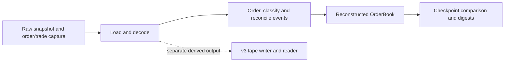
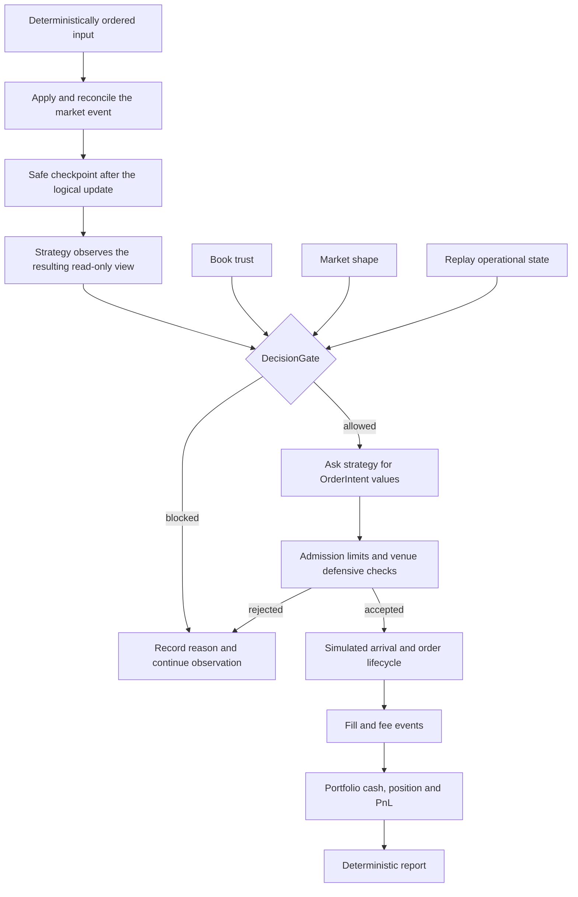

# Where the project is, and what comes next

Source snapshot: **2026-09-15, `d00e244`**. This is a plain-language explanation of the
current project and the reasons behind the next work. It is not a second checklist.
[TODO.md](../TODO.md) owns the active sequence and completion criteria;
[the handoff](handoff/status.md) owns the current status. Recommendations and teaching
examples below are not accepted design decisions. [ADR 0014](decisions/0014-event-loop-causality-and-decision-authority.md)
is still **proposed**.

## 1. Your current position

**You have built the market-reconstruction foundation. You are now designing the
deterministic trading simulator that will use it.**

Market reconstruction answers: "Given a starting snapshot and the later exchange
messages, what did the order book look like?" Your capture, decoder, order book,
merge/reconciliation and checkpoint code already address that question.

The next milestone answers a different question: "If my strategy requests an order
after seeing this market event, when can that order arrive, what can happen to it,
and exactly how does a fill change my account?" Those engine modules are still
placeholders. This is the transition into **Stage 5 of plan v4**. Older documents
use different slice numbers; that does not represent a different implementation.

The review identified defects inside existing capabilities as well as incomplete
future work. An unfinished engine loop is planned work. A validator accepting a
capture with an uncovered startup interval is a defect to repair. Keep those two
categories distinct when judging progress.

### What exists, with evidence

| Part | What it does in plain language | Current limit | Source to inspect |
|---|---|---|---|
| Capture and loading | Records Bitstamp order/trade streams, snapshots and metadata; loads segments into C++ values. | Recorder, Python validator and C++ admission do not yet enforce one complete contract. | [recorder](../scripts/dump_raw_ws_bitstamp.py), [validator](../scripts/validate_joined_capture.py), [segment loader](../src/capture/segment_loader.cpp) |
| Reference order book | Remembers individual orders, updates quantities and maintains price-level totals. | Some allocation-failure and aggregate-overflow paths need repair. | [OrderBook](../src/book/order_book.cpp), [PriceLevel](../src/book/price_level.cpp) |
| Replay and reconciliation | Places order/trade events in a deterministic sequence and avoids subtracting the same reported fill twice. | This reconstructs observed market activity; it does not simulate your own account or orders. | [Replay](../src/feed/bitstamp/replay.cpp), [MergeCursor](../src/feed/merge_cursor.cpp), [TradeReconciler](../src/feed/trade_reconciler.cpp) |
| Capture coordination | Replays multiple segments and compares resulting price-level quantities with an available checkpoint. | L2 agreement does not prove every order's quantity or its exchange queue priority. | [coordinator](../src/capture/capture_coordinator.cpp) |
| Book trust and shape | Represents snapshot/stream trust separately from visible best-price conditions. | The future engine still needs to own their transitions and combine them with operating policy. | [BookHealth](../src/book/book_health.cpp), [OrderBook interface](../include/te/book/order_book.hpp), [glossary](../CONTEXT.md) |
| Portable v3 files | Encodes and reads explicit binary order/trade records. | This is a derived tape. Current market replay does not consume it; raw capture remains the source record. | [tape writer](../src/capture/event_tape_writer.cpp), [segment reader](../src/telemetry/event_segment_reader.cpp), [format](specs/v3-segment-format.md) |
| Tests and CI | Exercises the implemented C++ modules, golden fixtures and architecture rules. | Python capture/validator suites need CI coverage; this documentation task did not rerun the C++ suite. | [test wiring](../tests/CMakeLists.txt), [CI](../.github/workflows/ci.yml) |

### What is still a placeholder

[Portfolio](../include/te/engine/portfolio.hpp),
[Strategy](../include/te/engine/strategy.hpp),
[Engine](../include/te/engine/engine.hpp),
[risk policy](../include/te/engine/risk.hpp),
[ExecutionVenue](../include/te/venue/venue.hpp),
[SimulatedVenue](../include/te/venue/simulated_venue.hpp),
[BookView](../include/te/book/book_view.hpp) and
[Feed](../include/te/feed/feed.hpp) do not contain those implementations yet.
The [portfolio test file](../tests/unit/test_portfolio.cpp) is also a placeholder.

[apps/replay_main.cpp](../apps/replay_main.cpp) currently returns without running an
engine, and its executable target is commented out in [CMake](../CMakeLists.txt).
The built `tep` application is the older recorder path. Do not confuse an existing
replay library test with a finished replay application.

## 2. See the gap between today's system and Stage 5

Today, the main useful path is:



A snapshot is the starting photograph. Events are the later changes. Replay applies
those changes to reconstruct the next photograph. A checkpoint is an independent
photograph used to compare the result. A digest is a compact fingerprint: it helps
detect differing results but does not prove the input was complete or correct.

Stage 5 will extend that market history into this proposed flow:



This diagram illustrates responsibilities. It does not settle the still-open
ordering of arrival, acknowledgements, fills and accounting in ADR 0014. Observation
here means observation of successfully processed market events; rejected inputs and
reseed/control notifications require their own explicit policy.

## 3. Three questions that must stay separate

| Question | Meaning | Example |
|---|---|---|
| **Can I trust the book?** | Was it reconstructed from an admitted snapshot and a continuous, successfully processed stream? | A missed event makes the history unreliable even if prices look normal. |
| **What shape is the market?** | Are both sides present, and how do best bid and best ask compare? | A trusted book can be one-sided. An untrusted book can still have an ordinary-looking spread. |
| **May the engine request a decision?** | Do trust, shape and replay operational policy permit it now? | An intentionally blocked run must not create new intentions merely because the book is trusted and open. |

Then there is another question: **is this particular intention admissible?** An engine
may permit a strategy decision and still reject its proposed order for exceeding a
quantity, notional or resulting-position limit. Decision permission and order admission
have different reasons and different responsibilities.

The gate reads these inputs. It does not make an untrusted book trusted, rewrite
market shape, or give the strategy direct access to the venue.

## 4. The next design task: finish the event timeline

An ADR is a short record of a design decision and its consequences. ADR 0014 is open
because several choices would change later test answers. **Finish those choices
before implementing the new engine modules.**

Consider this fictional timeline, in simulation milliseconds:

| Time | Event | Why the rule matters |
|---|---|---|
| 100 | An accepted market event updates the book. The strategy observes the completed update. | Seeing the old book would make the strategy react to the wrong state. |
| 100 | The gate permits a decision. The strategy requests a buy and admission accepts it. | A request is still not a fill or proof of exchange arrival. |
| 102 | Another market event changes available liquidity. | An order whose simulated arrival is 105 cannot have traded at 102. |
| 105 | The order arrives after an illustrative 5 ms outbound delay. A market event also has timestamp 105. | Which comes first? The answer may change fill eligibility. |
| Later | The venue generates a fill and a fee. | The engine must decide exactly when accounting changes and what a later callback can observe. |

The 5 ms delay is a teaching input, not a measured latency claim or selected model.
Simulation time comes from the scenario, not how quickly your laptop executes it.

Two reasonable first-fill rules need comparison: allow matching at arrival against
then-available liquidity, or require a later eligible market event. The first needs
an explicit arrival-matching rule; the second can understate immediate execution.
Neither should be selected accidentally by the order of two function calls. Neither
establishes that a hypothetical resting order had a real exchange queue position.

### Your first working session

Start with the first open question in TODO: minimal replay operational state.
Write expected outcomes for these scenarios before inventing enum names:

1. Trusted, open book; the scenario permits new intentions.
2. Trusted, open book; a scripted control input blocks new intentions.
3. Trusted, one-sided book; the scenario otherwise permits new intentions.
4. A gap invalidates trust while the visible prices still look open.
5. Synchronization completes; decide which conditions permit decisions again.

For each, record whether the input can be processed, whether observation occurs,
whether a decision is requested, and the reason if it is blocked. Specify whether a
control transition affects only new intentions or also already-open orders. Keep a
fatal internal structural error separate from a recoverable market-data gap.

My recommendation is to start with the smallest operational model that expresses
the required scenarios and keep named reasons separate. Add a state only when it
changes permitted behavior or transitions. Exact states remain your design choice;
live operator controls and production kill-switch wiring remain Stage 9 work.

Then complete the timeline above, including equal-time ordering, first fill,
acknowledgement, fee, accounting and subsequent observation. Do not invent a
"persistent crossed book" threshold without evidence. A safe checkpoint can block
decisions immediately while any escalation policy remains separately specified.

**The useful output of this session is a table with unambiguous answers.** Once all
open questions in ADR 0014 are resolved, accept the ADR and use those answers as test
expectations. No engine-class implementation is needed to do this work.

## 5. The first implementation after the ADR: Portfolio

Portfolio is the account state produced by fills: cash, signed position, cost basis,
realized profit/loss, unrealized profit/loss and fees. It is a useful first module
because you can verify its behavior with arithmetic before connecting a feed or a
strategy.

For the exercise below, assume whole units of a fictional asset and dollars shown
only for readability. Store money in exact integer units in code. We temporarily
keep realized PnL **before fees**, report fees separately, and use execution price
as the mark on fill rows. This is an explicit teaching convention, not an accepted
fee-allocation or marking policy for the project.

| Action | Cash | Position | Average entry | Realized PnL before fees | Unrealized PnL | Total fees | Equity |
|---|---:|---:|---:|---:|---:|---:|---:|
| Start | 1,000 | 0 | — | 0 | 0 | 0 | 1,000 |
| Buy 2 at 100; fee 1 | 799 | 2 | 100 | 0 | 0 | 1 | 999 |
| Mark the asset at 105 | 799 | 2 | 100 | 0 | 10 | 1 | 1,009 |
| Sell 1 at 110; fee 1 | 908 | 1 | 100 | 10 | 10 | 2 | 1,018 |
| Sell the last 1 at 90; fee 1 | 997 | 0 | — | 0 | 0 | 3 | 997 |

The first purchase costs `2 × 100 + 1 = 201`, leaving cash of 799. A price move to
105 changes the value of the holding, not cash. The first sale realizes 10 of gross
profit. The final sale realizes a gross loss of 10, cancelling that profit. Fees
leave the account 3 below its starting value.

For this convention, with no deposits or withdrawals:

```text
equity = cash + signed position × mark price
equity - starting equity = realized gross PnL + unrealized PnL - total fees
```

This gives you two independent ways to check each row. Fees are already deducted
from cash; do not subtract them from equity a second time.

Use this as the first test, then add partial exits, short positions, crossing through
flat, rejection and overflow. Cover average-price and notional rounding explicitly:
buying 1 unit at 100 and 2 at 101 gives an average of `302 / 3`, which is not an exact
whole-cent value. Fractional BTC quantities also create scale conversions. Integer
storage does not remove the need for a rounding policy, a cost-basis representation
and checked intermediate arithmetic.

Your first implementation attempt should follow the hand calculation. The existing
[portfolio header](../include/te/engine/portfolio.hpp) and
[test placeholder](../tests/unit/test_portfolio.cpp) are where that work belongs.

## 6. How the remaining Stage 5 pieces build on that

This table explains the sequence in TODO rather than maintaining separate progress
checkboxes. Each row should have small direct tests before the engine connects it.

| Next piece | What you build | Why this comes here | Evidence that it works |
|---|---|---|---|
| Intent and reason values | A request to trade plus explicit decision-block and rejection reasons. | Callers need to agree on what is requested and why it can be refused. | The same scenario returns the same specific reason. An intent alone changes no account balance. |
| Admission and simulated venue | Real quantity/notional/position limits; submit, accept/reject, cancel and fill transitions. | Portfolio supplies account facts; the accepted ADR supplies timing. | A permitted order can progress; an oversized order is rejected without changing open-order or portfolio state. |
| Strategy and read-only BookView | Separate observation from a request to decide; start with NoopStrategy. | The strategy can use the actual intention contract without owning mutable market state or execution authority. | Every successfully processed supplied event is observed; no-op produces no intentions. |
| Single-threaded engine | Connect input, book updates, observation, permission, venue and accounting in the accepted order. | Each module already has a defined responsibility and testable behavior. | A synthetic timeline checks what state each callback sees and when an order first becomes eligible. |
| Stage 5 evidence and application | A no-op run, a scripted trading run, a rejected order, repeatable reports, then the replay executable. | This proves the complete path rather than isolated classes. | Hand-calculated results match, rejection is visible, and ten identical runs produce matching digests. |

A NoopStrategy alone cannot prove fill, fee or accounting correctness because it
never requests an order. A scripted strategy should deliberately request a small
known order and an order that violates a real limit. It does not need a profitable
signal to test the engine.

## 7. Where the review repairs fit

The immediate learning task remains causality, followed by account arithmetic.
The following foundation repairs must be closed before using broader capture-based
Stage 5 results as correctness evidence. They are included in TODO's Stage 5 gate;
they do not require starting the project again.

| Repair | Concrete example of the problem | Why it matters to the next milestone | Rough focused effort |
|---|---|---|---|
| Align capture admission | Python can accept a seed older than the first captured order, reject a legitimate missing boundary checkpoint, or miss backward trade time. C++ does not require the whole validation contract. | The new strategy must not be tested against history that was silently incomplete. | 3–6 hours for validator cases; 1–2 days for a shared admission contract and consumer tests. |
| Make arithmetic and failure atomicity complete | Fill-credit/checkpoint totals can overflow; allocation failure after creating a price level can leave partial state. | Later accounting would inherit incorrect market state or undefined arithmetic behavior. | Roughly 1–2 days with boundary and allocation-failure tests. |
| Exercise the actual capture contract in CI | The Python capture/validator suites exist but are not run by the current workflow. | A future recorder edit must not silently break the validator or C++ consumer. | 1–2 hours for suite wiring; about 1 day for shared producer/consumer cases. |

These are planning estimates, not learning deadlines; unfamiliar C++ exception
safety or domain decisions can take longer. For the admission work, a single
validated-capture entry point is preferable to three independently drifting sets of
rules. It must retain why a segment was admitted or rejected.

The earlier review's diagnostics, dependency pinning, writer exclusivity, lexer,
clock-test and tape-precondition findings remain follow-up work. Do not turn them
all into prerequisites for writing the hand-worked timeline. Before Stage 6, also
strengthen order-level evidence and resolve queue assumptions: price-level agreement
alone cannot certify a hypothetical order's place in the exchange queue.

## 8. What to defer, and why

| Later stage | Reason to wait |
|---|---|
| Stage 6: queue labels and execution baselines | You first need a deterministic account/order lifecycle, then explicit assumptions for hypothetical fills. |
| Stage 7: held-out quantitative evaluation | A model trained on incorrect or leaking labels cannot repair the labels. |
| Stage 8: pools, intrusive structures, SPSC queues and optimized replay | A correct reference and measurements are needed to know whether an optimization helps and preserves behavior. The v3 replay integration belongs here when justified. |
| Stage 9: operational live/paper path | Live recovery, external actions and advanced controls multiply the states the engine must handle. Establish deterministic behavior first. |
| Stage 10: dashboard and showcase | Stable engine results and telemetry give the interface something meaningful to display. |

The next demonstrable milestone is therefore: **a committed scenario produces one
intention, one simulated fill and exact account changes; an invalid intention is
rejected for a named reason; repeating the run gives the same report.** Stage 5's
full completion criteria, including no-op conservation, remain in TODO.

## 9. What was verified for this guide

The checkout was rechecked at `d00e244`. Source, build wiring, placeholder modules,
the active TODO, handoff, glossary and proposed ADR were inspected against the
earlier repository review. Local untracked Claude commands/skills were preserved.

The handoff's 303-test result is dated **2026-09-09**. It is historical evidence,
not a fresh test result for this guide. The mandatory joined fixture is synthetic
and hand-written; the larger real-capture test can skip if local files are absent.
See [joined-capture tests](../tests/unit/test_bitstamp_joined_capture.cpp). The older
[order-only golden test](../tests/unit/test_golden_replay.cpp) explicitly retains
three unexplained adjustments; they are not established silent fills.

No new C++ behavior was implemented, no ADR was accepted, and no task was marked
complete during this documentation work. The first code attempt for each new
learning module remains yours, following plan v4's learning contract.
