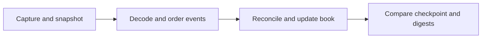
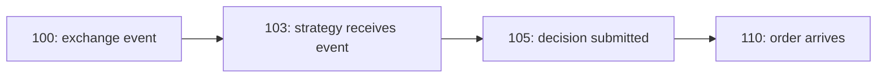
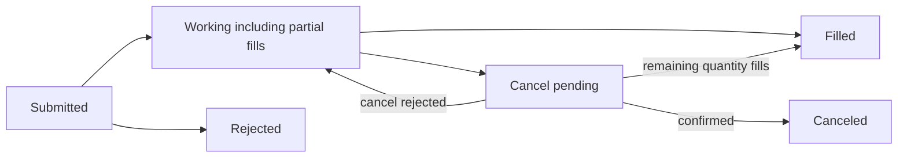

# Trading Engine: your next milestone

## 1. The recommendation, rechecked

**You are moving from market reconstruction into a trading simulator.** Keep the
single-threaded, test-first direction. Strengthen the contracts connecting time,
orders and money before adding more features.

Checked against source at **d00e244 on 15 September 2026** and the primary references
at the end. [TODO.md](../TODO.md) remains the only active checklist.
[ADR 0014](decisions/0014-event-loop-causality-and-decision-authority.md) is still
proposed. Recommendations here are not implemented features or accepted decisions.

### Keep these parts of the plan

- Decide event order before connecting engine modules.
- Build Portfolio from hand-calculated examples.
- Use a small simulated venue and a scripted strategy to prove the whole path.
- Leave concurrency, advanced queue models and the dashboard for their later stages.

### Strengthen these three parts

**Timing:** define when information becomes available to the strategy. An exchange
timestamp alone does not establish that. The previous example silently simplified
market-data delay; make that assumption explicit.

**Order risk:** include orders already waiting to fill. Checking each new order
against the current position alone can admit more exposure than the limit allows.

**Evidence:** close capture and state-integrity defects before engine integration.
Then produce a repeatable scenario, a fill/fee journal and a trace explaining results.

> Next milestone: one recorded scenario creates an intention, accepts it, simulates
> a fill and produces an account balance you can verify by hand. A second intention
> is rejected for a named reason. Repeat the run and obtain the same results.

### How to use the guide

Sections 2-3 show your position and sequence. Sections 4-6 explain time, money and
orders. Sections 7-8 describe useful upgrades and proof. Section 9 is your next
session worksheet. Sections 10-11 contain references and verification limits.

## 2. What you have today

Your implemented path reconstructs the market from a snapshot and later exchange
messages. It does not yet simulate your own strategy's account.



| Part | Current position |
|---|---|
| Capture, decoder and reference book | Implemented; specific failure and admission cases need repair. |
| Order/trade replay | Implemented with deterministic merging and reconciliation. |
| Book trust and market shape | Separate implemented concepts; the future engine must use them correctly. |
| Portable v3 file format | Writer and reader exist. Current replay still consumes raw captures. |
| Portfolio, Strategy, simulated venue and Engine | Headers remain placeholders. |
| Replay application | Placeholder; its executable target is disabled in CMake. |

**Snapshot:** a starting photograph. **Event:** a later change. **Checkpoint:**
another photograph used to compare reconstruction. **Digest:** a compact fingerprint
that helps detect differing outputs.

A matching digest supports repeatability. It does not prove complete input or a
realistic model. Matching price-level totals also does not prove individual order
quantities or exchange queue priority.

### Keep four questions separate

- **Trust:** is the book based on valid, continuous input?
- **Shape:** is the visible market empty, one-sided, locked, crossed or open?
- **Decision permission:** may the strategy propose an order now?
- **Admission:** does this particular order satisfy the limits?

A normal-looking spread can come from incomplete data. A trusted, open book can
still be blocked by operating policy. An allowed decision can still produce an
oversized order that admission rejects.

Evidence: [capture coordinator](../src/capture/capture_coordinator.cpp),
[replay](../src/feed/bitstamp/replay.cpp), [glossary](../CONTEXT.md),
[engine placeholder](../include/te/engine/engine.hpp), [CMake](../CMakeLists.txt).

## 3. The sequence I recommend

### First: settle the behavior on paper

Finish ADR 0014's open questions. Start with replay operating states, then complete
the sequence from input to observation, intention, arrival, fill and accounting.
Your output is a scenario table with unambiguous expected outcomes.

### Second: make the account arithmetic exact

Write a buy, partial sale, final sale and fee example. Decide currency scales, cost
basis, rounding and failure behavior. Then write Portfolio tests and your first
implementation. Section 5 gives a worked starting point.

### Third: repair the foundation before connecting the engine

Align recorder, validator and C++ admission. Close aggregate overflow and allocation
rollback gaps. Run the Python capture suites in CI. Paper exercises can proceed
first; these repairs belong before integration rather than at its final gate.

### Fourth: build the smallest real order lifecycle

Define intention and reason values. Add quantity/notional/position checks, including
outstanding exposure. Build accept, reject, partial fill, fill and cancel behavior.
Resolve timing through the ADR before implementing it.

### Fifth: connect observation, decisions and accounting

Add read-only strategy observation and NoopStrategy. Wire the single-threaded engine
in the accepted order. Add a scripted strategy requesting a known order and a
rejected order. Trace which state each callback sees.

### Sixth: package the evidence

Run committed scenarios, compare ten repeated runs and expose the replay application.
Save input/configuration identities, results and an explanation of decisions and
fills. Distinguish synthetic proof from real-corpus evidence.

> Start the next session with section 9. Small scenarios determine class behavior;
> additional class skeletons would not settle the open questions.

## 4. Time: what did the strategy know?

**A strategy can react only to information available to it.** Separate exchange
event time, delivery to the strategy and arrival of its resulting order.
NautilusTrader similarly distinguishes event and initialization timestamps and
documents deterministic backtest ordering by initialization time [S1].

This fictional scenario uses simulation milliseconds on an aligned time base.
The delays are chosen test inputs, not measured latencies.



An opportunity disappearing at 108 cannot fill an order arriving at 110. If a
market event also occurs at 110, the scenario needs an explicit tie rule.

### Rules to settle

1. When can the strategy see a successfully processed market event?
2. What simulated time is assigned to a submitted intention?
3. Can it match at arrival, or only on a later eligible event?
4. Which wins a tie: market update, arrival, cancellation or control?
5. When do fill, fee and account changes become visible to the next callback?

Do not blindly replace the venue-time merge used for book reconstruction. Strategy
information availability is another contract. Preserve both concepts and required
provenance in the Stage 5 event envelope. Raw clocks can have skew; receipt time
minus exchange time is not automatically network latency.

**Zero market-data delay is a valid first declared assumption.** It does not justify
a latency-realism claim. Arrival matching and later-event matching make different
assumptions. QuantConnect's fill-model guidance illustrates the need to specify
fill rules and stale-price behavior [S2].

Observe successfully processed events after the complete logical book update.
The DecisionGate reads independent trust, shape and operating state. Rejected
data, reseeding and fatal structural failure need their own explicit handling.

## 5. Money: a result you can check by hand

Portfolio turns fills into cash and holdings. Use whole units of a fictional asset
first. Amounts below are displayed in dollars; code uses declared integer money
units. On fill rows, execution price is the illustrative valuation mark.

| Action | Cash | Units held | Total fees | Equity |
|---|---:|---:|---:|---:|
| Start | 1,000 | 0 | 0 | 1,000 |
| Buy 2 at 100; fee 1 | 799 | 2 | 1 | 999 |
| Mark price moves to 105 | 799 | 2 | 1 | 1,009 |
| Sell 1 at 110; fee 1 | 908 | 1 | 2 | 1,018 |
| Sell the final 1 at 90; fee 1 | 997 | 0 | 3 | 997 |

**Cash** changes when money is spent or received. **Equity** also includes holdings:
cash plus signed position multiplied by the mark price.

The first sale realizes gross profit of 10. The last realizes gross loss of 10.
Gross realized PnL ends at zero; fees explain the final loss of 3. At the 105 mark,
the open position has unrealized profit of 10, which has not become cash.

For this exercise, report gross PnL and fees separately:

```text
equity - starting equity
    = realized gross PnL + unrealized PnL - fees
```

This assumes no deposits or withdrawals. Fees are already deducted from cash;
do not subtract them from equity again. These marking and fee conventions are
teaching assumptions, not an accepted project accounting policy.

### Decide before coding

- Name the currency/scale of cash and fees; price ticks are not money.
- Choose cost-basis representation. Buying 1 at 100 and 2 at 101 gives average `302 / 3`.
- Specify rounding for fractional quantities, notional and fees; check intermediate arithmetic.
- Define shorts and crossing through flat.
- Give executions identities so the same economic fill cannot post twice.
- Reject unsafe arithmetic without partially changing the account.

NautilusTrader also uses fixed-point trading value types [S3]. That supports the
direction; this project's scales and rounding remain explicit design choices.

## 6. Orders: acceptance is only the beginning

A state machine is a set of states and allowed transitions. This is a small
teaching model, not a claim of FIX protocol compliance.



**A cancel request is not confirmed cancellation.** FIX explicitly distinguishes
these states and includes executions occurring during pending cancellation [S4].
Adopt the useful semantics; a FIX network adapter can wait.

| Event for an order of 10 units | Filled so far | Still executable |
|---|---:|---:|
| Accepted | 0 | 10 |
| Fill 4 | 4 | 6 |
| Request cancellation | 4 | 6 |
| Another fill of 2 before cancellation | 6 | 4 |
| Cancellation confirmed for remainder | 6 | 0 |

Cancellation does not undo the six units filled. For a working order, requested
quantity equals filled plus remaining executable quantity. After cancellation,
account for the canceled remainder separately. The exact representation remains
a design decision.

### Count orders that have not filled yet

Suppose the maximum long position is 10, current position is zero, and an accepted
buy for 6 is outstanding. Another buy for 6 creates potential exposure of 12.
Checking only current position plus the new order misses this.

Reserve exposure at the chosen admission point. Release it on fills or confirmed
cancellation/rejection according to the lifecycle. Test positive and negative
worst-case exposure separately; opposite orders need not fill together.

NautilusTrader's locked/free balance model is a useful comparison [S5]. The specific
position-limit calculation above is our recommendation, not a quoted universal rule.

## 7. Five upgrades worth building

These strengthen Stage 5 evidence. Detailed interfaces remain proposed until the
relevant decisions are settled. Efforts assume the core engine already exists.

### 1. A reusable scenario runner

Express market events, control changes and expected outcomes as test data. Reuse
the scenarios in tests and the eventual application. Name the first event that
disagrees. Begin with existing GoogleTest and committed examples.
**Rough effort: 1-2 days.**

### 2. A fill and fee journal

Record execution ID, order ID, quantity, price, fee and account changes. Replay it
into a fresh Portfolio and reproduce the balances. Define duplicate-execution
behavior. Start in memory with a small export; a database is unnecessary.
**Rough effort: 1-2 days.**

### 3. A reproducible run bundle

Save input hashes, commit/build identity, dirty-tree state, instrument scales,
configuration, optional random seed, exclusions and output digests. Include fee,
rounding, fill, ordering and latency policy versions. Plan v4 already calls for
this; make it a concrete deliverable. W3C PROV supplies a formal provenance model
[S6], while a small JSON manifest is enough here. **Rough effort: 1 day.**

### 4. A trace that explains the first difference

Attach input ordinal, logical time, reason and before/after state summaries.
Compare intermediate order/account states, not just final totals. Make detailed
traces selectable so they do not dominate later benchmarks.
**Rough effort: 1-2 days.**

### 5. Adversarial scenarios that remain reproducible

Preserve regression cases for gaps, duplicates, backward time, equal-time events,
partial fills, cancel races and limits. Then add seeded generated sequences and
an independent simple state model. Hypothesis describes model-based testing [S7];
NautilusTrader describes seed-replayable simulation [S8]. Adapt the patterns before
adding frameworks. **Initial effort: 1-2 days.**

The estimates overlap and exclude engine implementation. They are focused
engineering estimates, not learning deadlines.

## 8. What counts as convincing evidence?

### Repair input and mutation contracts first

Before integration, require recorder, validator and C++ consumer to agree on
snapshot coverage, continuity, interrupted segments and stream ordering. Corrupt
input must produce a named rejection. Fix aggregate overflow and incomplete
allocation rollback with direct regression cases.

Run Python capture/validator suites in CI. Declare the Python environment and hash
downloaded C++ archives, following PyPA and CMake guidance [S9, S10]. Include Release
checks for behavior affected by disabled assertions.

### Give each test a question

| Test | What it establishes |
|---|---|
| NoopStrategy over committed input | Complete observation; unchanged cash and holdings. |
| Scripted order plus hand calculation | Intention, admission, fill, fee and accounting work together. |
| Oversized order with outstanding exposure | A real limit rejects without changing state. |
| Partial fill followed by cancel race | Later fills and canceled remainder stay consistent. |
| Duplicate execution | The same economic fill cannot post twice. |
| Ten identical runs | Outputs repeat under the same inputs and policies. |
| Intermediate order-level comparison | Equal price-level totals cannot hide different order state. |
| Corrupt capture and allocation failure | Failure stops safely with a precise reason. |

Repeatability, internal correctness and market realism are different claims.
A synthetic scenario proves a specified rule. An independent venue checkpoint
provides different evidence. Neither alone establishes fill probability for a
hypothetical order.

Do not infer exchange queue priority from snapshot row order. Keep later fill-model
assumptions versioned and visible. Traces and sanitizers support correctness;
performance claims need separately recorded optimized-build measurements.

## 9. Your next working session

**Deliverable: one page of behavior, then one complete event timeline.**
Write outcomes for these situations before choosing enum names.

| Situation | What to decide |
|---|---|
| Trusted, open market; operation permits trading | When is observation complete and a decision requested? |
| Trusted, open market; scripted operating block | Are new intentions blocked? What happens to existing orders? |
| Trusted, one-sided market | Does observation continue for accepted events? What blocks decisions? |
| Gap followed by synchronization | What is buffered/rejected, and what restores readiness? |
| Arrival and cancellation share a logical time | Which happens first, and can a fill still occur? |

Keep structural corruption separate from a data gap. Use a fatal internal failure
rather than trying to repair broken C++ state with another snapshot. Block decisions
at a crossed safe checkpoint; do not invent a lost-trust duration threshold without
evidence.

Complete section 4's timeline and explain section 5's arithmetic in your own words.
Resolve the ADR's open questions before implementation. For each module: behavior,
small test, your first attempt, review, focused checks, then broader validation.

### What can wait

| Stage | Why it follows Stage 5 |
|---|---|
| 6: queue labels and execution baselines | Needs a stable lifecycle and explicit assumptions. |
| 7: held-out quantitative evaluation | Needs trustworthy labels and leakage controls. |
| 8: performance and v3 replay integration | Needs a correct reference, equivalent results and measurements. |
| 9: live/paper operations | Adds external actions, recovery and advanced controls. |
| 10: dashboard and showcase | Needs stable reports and useful engine evidence. |

The next milestone is an explainable trading simulation. Profitable signals,
multiple venues and lock-free queues are outside that milestone.

## 10. Industry references

There is no universal trading-engine architecture. Formal specifications,
published implementations and our project choices have different authority.

**S1 - Timing pattern.** [NautilusTrader: Data](https://nautilustrader.io/docs/latest/concepts/data/).
Distinct timestamps, stable ordering and clock-skew caveats. Use it to evaluate
information availability, not to replace Bitstamp reconstruction ordering blindly.

**S2 - Simulation guidance.** [QuantConnect: Trade fills](https://www.quantconnect.com/docs/v2/writing-algorithms/reality-modeling/trade-fills/key-concepts).
Fill price/quantity, partial-fill models and stale prices. Supports explicit
assumptions, not a claim that our simulator matches a venue.

**S3 - Value representation.** [NautilusTrader: Value types](https://nautilustrader.io/docs/latest/concepts/value_types/).
Fixed-point Price, Quantity and Money. Our exact scales and rounding remain choices.

**S4 - Industry protocol semantics.** [FIX: Order state changes](https://www.fixtrading.org/online-specification/order-state-changes/).
Order status and pending-cancel/partial-execution behavior. Borrowing semantics
does not make the project FIX compliant; no Stage 5 FIX adapter is proposed.

**S5 - Accounting pattern.** [NautilusTrader: Accounting](https://nautilustrader.io/docs/latest/concepts/accounting/).
Locked and free balances distinguish committed from available resources.
Our outstanding-position limit still needs its own tests.

**S6 - Formal provenance model.** [W3C: PROV-DM](https://www.w3.org/TR/prov-dm/).
A W3C Recommendation for traceable entities and activities. Use that principle;
RDF/ontology integration is unnecessary.

**S7 - Testing pattern.** [Hypothesis: Stateful tests](https://hypothesis.readthedocs.io/en/latest/stateful.html).
Action sequences compared with a simpler model. Existing GoogleTest scenarios
can establish this style before another tool is introduced.

**S8 - Simulation-testing pattern.** [NautilusTrader: Deterministic simulation testing](https://nautilustrader.io/docs/latest/concepts/dst/).
Seed-controlled, replayable failure exploration. Adopt the needed scope.

**S9 - Packaging guidance.** [PyPA: Repeatable installs](https://pip.pypa.io/en/stable/topics/repeatable-installs/).
Declare and pin Python dependencies for another checkout.

**S10 - Build-tool guidance.** [CMake: URL hashes](https://cmake.org/cmake/help/v4.3/module/ExternalProject.html).
Verify fetched archives. The cited version does not imply this project needs
a CMake upgrade.

## 11. Repository evidence and limits

### Where to look

| Claim | Source |
|---|---|
| Causality remains open | [ADR 0014](decisions/0014-event-loop-causality-and-decision-authority.md), status and open questions. |
| Portfolio/engine are placeholders | [portfolio.hpp](../include/te/engine/portfolio.hpp), [engine.hpp](../include/te/engine/engine.hpp), [portfolio test](../tests/unit/test_portfolio.cpp). |
| Replay exists as library behavior | [replay.cpp](../src/feed/bitstamp/replay.cpp), [coordinator](../src/capture/capture_coordinator.cpp). |
| Replay application is unfinished | [replay_main.cpp](../apps/replay_main.cpp), [CMakeLists.txt](../CMakeLists.txt). |
| C++ capture envelopes retain limited metadata | [captured_events.hpp](../include/te/feed/captured_events.hpp); availability needs an explicit Stage 5 contract. |
| Reports/fingerprints can support better traces | [replay.hpp](../include/te/feed/bitstamp/replay.hpp), [coordinator report](../include/te/capture/capture_coordinator.hpp). |
| Run manifest is already planned | [Plan v4, section 8](project-plan-v4.md). |
| Mandatory and optional evidence differ | [joined-capture tests](../tests/unit/test_bitstamp_joined_capture.cpp), [legacy golden test](../tests/unit/test_golden_replay.cpp). |
| Foundation repairs remain open | [validator](../scripts/validate_joined_capture.py), [OrderBook](../src/book/order_book.cpp), [reconciler](../src/feed/trade_reconciler.cpp), [CI](../.github/workflows/ci.yml). |

### What this recheck establishes

The source snapshot and relevant contracts were re-inspected. Recommendations
were compared with the linked primary sources. The arithmetic is a teaching
example, not a selected live accounting policy. No upgrade is claimed implemented.

The documented **303 passing C++ tests on 9 September 2026** remain historical.
This documentation/PDF task did not perform a new engine build or test run.
The committed joined fixture is synthetic; real-capture tests can skip when local
data is absent. Three legacy order-only adjustments remain unexplained, not
established silent fills.

The editable guide is [this Markdown file](project-progress-guide.md).
The PDF exports the same content. [TODO.md](../TODO.md) owns task completion;
[the handoff](handoff/status.md) owns current status. Regenerate the PDF when this
guide changes.
